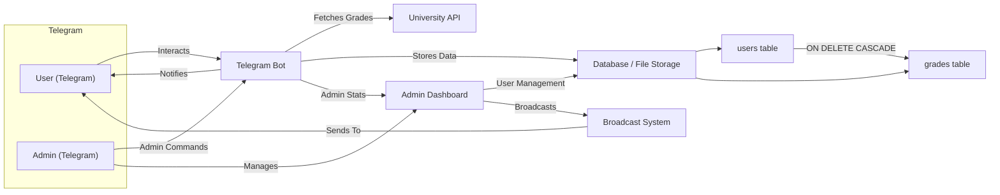

# 🎓 Telegram University Bot

**Version:** 2.5.5

---

## What's New in v2.5.5
- User deletion now cascades to grades (ON DELETE CASCADE)
- Migrations script runs automatically on every deploy in Railway
- Environment variables are loaded before any script (migrations/main)
- Final fixes and improvements in admin dashboard and broadcast
- Everything works on Railway with no manual intervention

---

## Overview
Telegram University Bot is an advanced notification and management system for university students. It fetches, stores, and notifies users about their academic grades, and provides a powerful admin dashboard for analytics, user management, and broadcasting.

---

## Features
- **Instant Grade Notifications:** Real-time updates when grades change.
- **Admin Dashboard:** User analytics, broadcast messages, and user management.
- **Automated Grade Checks:** Periodic background checks for grade updates.
- **Multi-Storage Support:** PostgreSQL and file-based storage.
- **Automatic Migrations:** Database schema updated automatically on every deploy.
- **Secure & Configurable:** All sensitive data and settings via environment variables.
- **Easy Deployment:** Optimized for Railway, works on any Python platform.
- **User Management:** Admins can search, view, and delete users (with cascading grade deletion).
- **Broadcast System:** Admins can send messages to all users.
- **Backup & Restore:** Automated backups for user and grade data.

---

## Architecture Diagram


---

## File/Folder Structure
```
telegram_university_bot/
├── admin/
│   ├── __init__.py
│   ├── broadcast.py
│   └── dashboard.py
├── bot/
│   ├── __init__.py
│   └── core.py
├── config.py
├── data/
│   └── users.json
├── debug_api_response.py
├── main.py
├── migrations.py
├── Procfile
├── README.md
├── requirements.txt
├── storage/
│   ├── __init__.py
│   ├── credential_cache.py
│   ├── grades.py
│   ├── models.py
│   ├── postgresql_grades.py
│   ├── postgresql_users.py
│   ├── test_grades.py
│   ├── test_users.py
│   └── users.py
├── university/
│   ├── __init__.py
│   └── api.py
├── UPDATE.md
└── utils/
    ├── __init__.py
    ├── keyboards.py
    └── messages.py
```

---

## Requirements
- Python 3.8+
- PostgreSQL (recommended for production)
- Telegram Bot Token

---

## Environment Variables
Set these in your Railway dashboard or `.env` file:
- `TELEGRAM_TOKEN` — Your Telegram bot token (required)
- `ADMIN_ID` — Telegram user ID of the admin (required)
- `DATABASE_URL` — PostgreSQL connection string (recommended)
- `BOT_VERSION` — Bot version string (optional, default: dev)
- `GRADE_CHECK_INTERVAL` — Interval (in minutes) for grade checks (default: 15)
- (Other variables as needed in `config.py`)

---

## Setup & Deployment
### 1. Clone the Repository
```bash
git clone <your-repo-url>
cd telegram_university_bot
```
### 2. Install Dependencies
```bash
pip install -r requirements.txt
```
### 3. Configure Environment Variables
Set the required variables in Railway's dashboard or a `.env` file.
### 4. Deploy to Railway
- Push your code to GitHub and connect your repository to Railway.
- Railway will automatically build and deploy your bot using the `Procfile`.
- Migrations are run automatically before the bot starts.
### 5. Local Development
To run locally:
```bash
python migrations.py  # Run migrations (optional if using Railway)
python main.py        # Start the bot
```

---

## Usage
- Users interact with the bot via Telegram to register, check grades, and receive notifications.
- Admins access the dashboard for analytics, user management, and broadcasting.

---

## Admin Features
- **Dashboard:** View user stats, grade analytics, and recent activity.
- **User Management:** Search, view, and delete users (deletion cascades to grades).
- **Broadcast:** Send messages to all users.
- **Security:** Only the admin (as set by `ADMIN_ID`) can access admin features.

---

## Grade Notification Logic
- The bot checks for grade changes every `GRADE_CHECK_INTERVAL` minutes.
- Only changed courses are notified to the user, with both old and new values shown.
- Notifications are sent in the user's preferred language.

---

## Database & Migrations
- Uses SQLAlchemy models for database schema.
- Migrations are handled by `migrations.py` and run automatically on Railway.
- Grade deletion is cascaded when a user is deleted (ON DELETE CASCADE).

---

## Testing
- Unit tests are provided for storage modules.
- Run all tests with:
```bash
pytest
```

---

## License
MIT

---

## Contact
- Developer: Abdulrahman Abdulkader
- Email: abdulrahmanabdulkader59@gmail.com
- Telegram: @sisp_t
